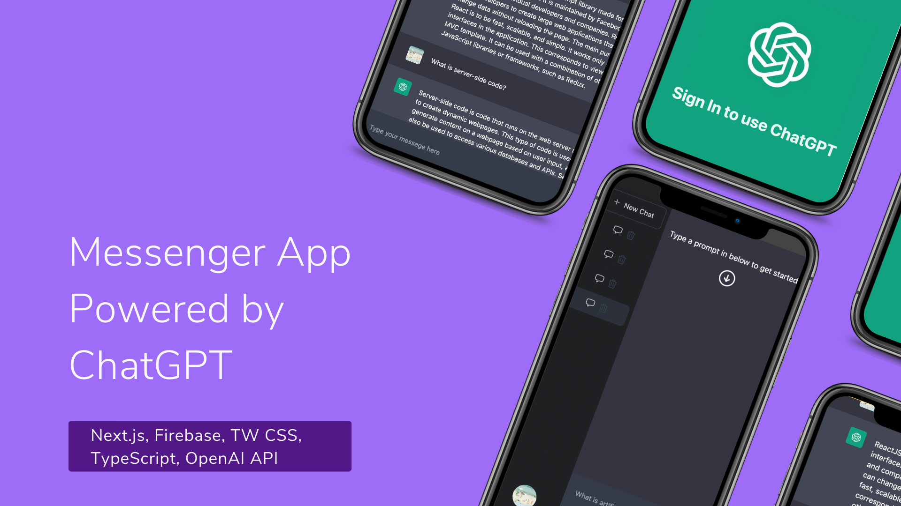

# Messenger Application Returning Answers from ChatGPT

This is a messenger app powered by ChatGPT API for returning answers. User authentication connects to Firebase Auth. Built using Next.js 13. Among technologies used are Typescript, Next.js 13 (powered by React), Firebase, Firestore, TailWind css, ChatGPT API, NextAuth, Firebase Auth, SWR in data fetching, React Firebase hooks, Server components, Firebase Admin. Deployed and hosted on Vercel.

Screenshot of application:

Live link, [TBD]()

## Table of Contents

* [Installation](#Installation)
* [Usage](#Usage)
* [Contributing](#Contributing)
* [Tests](#Tests)
* [License](#License)
* [Questions](#Questions)

## Installation
Feel free to clone the repo or reference the code and simply run it in your browser.

## Usage
Great for practicing various web technologies.

## Contributing
If you would like to add anything, please reach out.

## Tests
n/a

## License
This project is released under MIT opensource license:
https://opensource.org/licenses/MIT

## Questions
For more about my work, check out my Github profile: https://github.com/nard1n

If you have any questions and would like to chat, please feel free to send me an email directly to nardincodes@gmail.com
